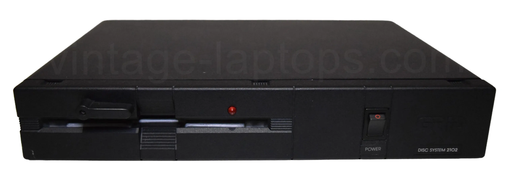

# Reverse Engineering of 2102 Floppy Drive

Photo was taken from the [vintage-laptops.com](https://vintage-laptops.com/en/per-gridcompass1121/).

This is a project to reverse engineer the 2102 floppy drive from 1983 for the GRiD Compass laptop. The project is for fun and to fix bugs in the [blackgpib](https://github.com/vklachkov/blackgpib) project.

Current status:

2. Complete schematics by [@JDat](https://github.com/JDat).
3. Full dump of PAL chip by [@JDat](https://github.com/JDat).
4. Firmware reverse engineering is ~80% complete by [me](https://github.com/vklachkov) and Kirill from [Xecut Hackspace](https://xecut.me/).
